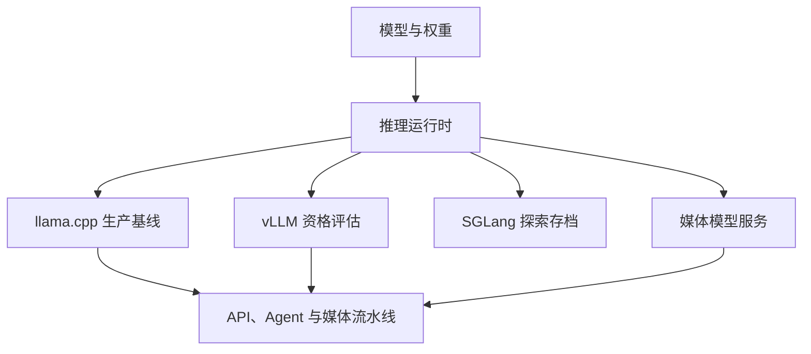

# Qwen3.8-27B · 4090 推理工程栈

> 面向本地 Coding Agent、长上下文、多模态媒体处理与可复现实验的 Qwen3.8-27B 工程仓库。
> 覆盖模型装载、推理运行时、KV cache、投机解码、量化、后训练、评测门禁、媒体服务与机器级运维。


## 项目导航

### 运行时与服务

| 模块 | 状态 | 入口 | 说明 |
|---|---|---|---|
| llama.cpp | ✅ 生产基线 | [`inference/llamacpp/`](inference/llamacpp/) | b10715、多副本、256K、OpenResty/Lua 会话粘滞 LB |
| vLLM | 🧪 当前性能主线 | [`inference/vllm/`](inference/vllm/) | DFlash2、KVarN、长上下文和 Coding Agent 服务 |
| SGLang | ⛔ 探索存档 | [`inference/sglang/`](inference/sglang/) | 完整保留探索、基准和回归原因，当前不作为生产引擎 |
| 媒体服务 | ✅ 独立工作流 | [`media/serve/`](media/serve/) | ASR、文本、视觉和视频模型的服务脚本 |

### 评测与证据

| 模块 | 入口 | 用途 |
|---|---|---|
| 总评测地图 | [`eval/README.md`](eval/README.md) | 所有引擎和质量门禁的总入口 |
| llama.cpp 门禁 | [`eval/llamacpp/README.md`](eval/llamacpp/README.md) | A/B、语义 Gate、RFT 沙箱和 rulers 基线 |
| vLLM 评测 | [`eval/vllm/README.md`](eval/vllm/README.md) | P0、drafter、质量 A/B、CUDA 13 和长上下文 |
| vLLM 0.29 总纲 | [`eval/vllm/nextgen-20260917/MASTER-TEST-PLAN.md`](eval/vllm/nextgen-20260917/MASTER-TEST-PLAN.md) | 当前下一代资格评估的唯一执行计划 |
| FastLLM 资格 | [`eval/fastllm/README.md`](eval/fastllm/README.md) | 已归档的替代性验证和失败证据 |

### 工程资料

| 模块 | 入口 |
|---|---|
| 深度分析与优化 | [`docs/`](docs/) |
| 后训练与 LoRA | [`training/`](training/) |
| 媒体生产线 | [`media/`](media/) |
| 模型结构与模板 | [`model/`](model/) |
| 机器运维与监控 | [`ops/`](ops/) |

## 当前结论

截至 2026-09-17，必须区分“已经认证的服务”“历史资格结果”和“正在验证的下一代路线”：

| 层级 | 结论 |
|---|---|
| 生产基线 | llama.cpp b10715：多副本 256K，OpenResty/Lua 会话粘滞，语义与跨副本／跨重启证据完整 |
| 历史高速基线 | vLLM 0.27.1 + KVarN + DFlash2：单卡 24GB 已保留 240K／262K 结果，最高约 136.47 tok/s |
| 0.28 迁移证据 | vLLM 0.28/cu130 原生 DFlash2 32K 纯文本新启动均值约 141.625 tok/s；无 KVarN 时原生 KV 上限约 43,264 token |
| 当前主线 | vLLM 0.29 + TP2：target-only → DFlash2 → KVarN → 长上下文／并发／真实 Agent |
| 已否决 | FastLLM 当前未达到替代 vLLM 的兼容性、容量和部署门槛；SGLang 因结构化 tool_use 缺口回归 llama.cpp |

> “当前主线”不是生产切换授权。所有切换必须等待功能、质量、性能、稳定性和同规格复现门全部通过。

## 三分钟理解架构



- `inference/` 负责服务运行时、镜像和构建配方。
- `eval/` 负责可证伪门禁、A/B 试验、质量检查和原始证据。
- `training/` 负责 QLoRA、MTP/drafter、LoRA→GGUF 和后训练记录。
- `media/` 负责 ASR、视觉、多模态和新闻结构化生产链。
- `ops/` 负责 GPU、功耗、监控、噪声模式和长稳巡检。

## 硬件与模型口径

| 项目 | 当前口径 |
|---|---|
| 当前资格评估 | 4× RTX 4090 24GB，具体卡位、拓扑和隔离规则以测试总纲为准 |
| 历史整机实验 | 仓库早期保留 8× RTX 4090 的整机测量；不得与当前 TP2 结果直接混算 |
| 生产推理 | llama.cpp b10715，多副本 256K，入口 `:8000` |
| vLLM 主线 | vLLM 0.29 + TP2 + Qwen3.8-27B coding-v1.1 |
| 生产权重 | `Qwen3.8-27B-Heretic-Ara-iq4_xs-3.0-mtp.gguf` |
| Coding Agent 权重 | `Qwen3.8-27B-coding-v1.1-W4A16`，AutoRound W4A16 + INT8 lm_head/embed |
| 投机解码 | llama.cpp 内嵌 MTP；vLLM 使用 DFlash2，当前候选 `k=7` |

模型权重、编译缓存和大型产物不入库。下载后必须按相应报告的来源和 SHA256 清单校验。

## 快速开始

### llama.cpp 生产基线

```bash
git clone https://github.com/pwl1987/qwen3.8-27b-8x4090-stack.git
cd qwen3.8-27b-8x4090-stack/inference/llamacpp
docker compose up -d
# 可选：启动 GPU 与副本监控
docker compose --profile mon up -d
```

默认入口为 `:8000`。首次部署前请阅读 [`inference/llamacpp/README.md`](inference/llamacpp/README.md)。

### vLLM 单卡高速线路

```bash
cd qwen3.8-27b-8x4090-stack/inference/vllm
cp .env.example .env
docker compose up -d
```

该线路需要本地模型、DFlash2 drafter、CUDA 镜像和权重目录；示例命令不得未经检查直接用于生产卡。详见 [`inference/vllm/README.md`](inference/vllm/README.md)。

## 关键实测索引

| 线路 | 代表结果 | 结论属性 |
|---|---|---|
| llama.cpp | 64K 单流 71.8–79.8 tok/s；195K 约 28.3–35.3 tok/s；16 slot 聚合约 420 tok/s | 生产基线 |
| vLLM 0.27.1 + KVarN | 262K 完整窗口约 136.47 tok/s；BF16 65K 基准约 178.72 tok/s | 历史资格 |
| vLLM 0.28/cu130 + DFlash2 | 32K 纯文本新启动均值约 141.625 tok/s；acceptance 32.082% | 迁移证据 |
| SGLang | KV 池实测约 216,938 token；结构化 tool_use 缺口导致回归 | 探索存档 |
| FastLLM | 当前 W4A16 目标未形成可部署替代线路 | 归档否决 |

详细数字以对应 `REPORT.md` 和 `raw/` 权威证据为准。

## 当前下一代路线

1. 修正夹具、时间窗和指标命名，复现 vLLM 0.28 冻结锚点。
2. 认证 vLLM 0.29：target-only → DFlash2 → KVarN。
3. 以 TP2 作为 Coding Agent、低延迟和长上下文主基线，TP1 作为吞吐对照。
4. 比较 native／FP8／KVarN KV、DFlash2、MRV2、CUDA Graph、prefix cache 和量化形制。
5. 对比 TP1、TP2、四卡混合拓扑及真实 Pi／Claude Code 工作负载。
6. 通过功能、质量、API、安全、2h／8h／24h 稳定性后，再进行同规格设备 clean-room 复现。

## 证据规则

- `raw/` 是原始证据，`REPORT.md` 是解释层；失败、无效和否决结果同样保留。
- A/B 必须绑定相同模型、fixture、输出预算、停止条件、采样参数、缓存状态和客户端版本。
- 性能差异小于 3% 默认不算赢；质量、安全、OOM、崩溃不适用该容忍。
- 不同夹具、不同输出长度或不同 GPU 拓扑不得直接计算加速比。
- 提交前执行脱敏扫描；不得提交权重、密钥、cookie、私密 prompt、compile cache 或大型二进制。

## 许可证与来源

本仓库代码、配置和评测资料采用 MIT 许可证，详见 [`LICENSE`](LICENSE)。
`inference/vllm/` 含来自 [syv-ai/qwen38-27b-rtx3090](https://github.com/syv-ai/qwen38-27b-rtx3090) 的 Apache-2.0 代码，相关许可证随目录保留。
模型权重版权归原作者所有，权重文件不随本仓库发布。
