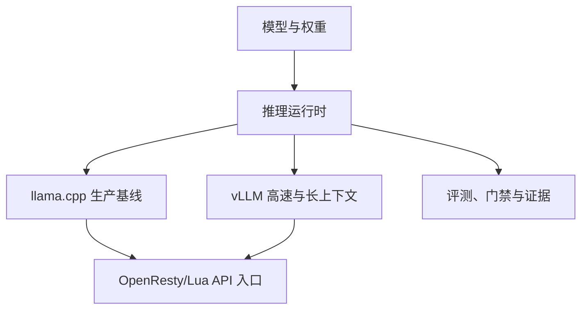

# Qwen3.8-27B · 4090 推理工程栈

> 面向本地 Coding Agent、长上下文、多模态媒体处理与可复现实验的 Qwen3.8-27B 工程仓库。
> 这里保存的不只是启动脚本，而是从模型装载、推理运行时、KV cache、投机解码、量化、后训练到评测门禁的完整证据链。


## 先看结论

截至 2026-09-17，仓库结论按状态分层如下。历史数据仍然保留，但不与当前 vLLM 0.29 资格评估混为一谈。

| 状态 | 线路 | 当前结论 |
|---|---|---|
| ✅ 已认证 | llama.cpp b10715 | 生产主力；4 副本、OpenResty/Lua 会话粘滞、单副本 256K，上下文与语义门禁证据完整 |
| ✅ 历史资格 | vLLM 0.27.1 + KVarN + DFlash2 | 单卡 24GB 形制已达到 240K/262K 档位，最高保留结果约 136.47 tok/s；作为回归基线 |
| 🧪 当前主线 | vLLM 0.29 + TP2 | 下一代主验证方向：target-only → DFlash2 → KVarN → 长上下文／并发／真实 Agent |
| 🟡 独立验证 | vLLM 0.28 + CUDA 13 | 兼容性与 DFlash2 已有资格结果；原生 KV 无 KVarN 时上下文能力明显不足 |
| ⛔ 已归档 | FastLLM | 在当前 W4A16 检查点和 RTX 4090 主机上未达到替代 vLLM 的条件；证据保留，当前不继续占用实验资源 |

### 当前主线不等于生产切换

当前 README 的“主线”指正在进行的资格评估，不代表已经授权替换生产服务。生产切换必须等待质量、性能、稳定性和复现门全部通过，并由仓库所有者拍板。

## 你可以从这里开始

| 目标 | 入口 |
|---|---|
| 运行稳定的 llama.cpp 生产线 | [`inference/llamacpp/`](inference/llamacpp/) |
| 了解 vLLM 当前单卡高速线路 | [`inference/vllm/`](inference/vllm/) |
| 查看 vLLM 0.29 下一代测试总纲 | [`eval/vllm/nextgen-20260917/MASTER-TEST-PLAN.md`](eval/vllm/nextgen-20260917/MASTER-TEST-PLAN.md) |
| 查看已认证与已否决结果 | [`eval/vllm/`](eval/vllm/) 与 [`eval/llamacpp/`](eval/llamacpp/) |
| 查看服务深度分析 | [`docs/QWEN27B-ANALYSIS.md`](docs/QWEN27B-ANALYSIS.md) |
| 查看完整优化日志 | [`docs/VLLM-OPTIMIZATION.md`](docs/VLLM-OPTIMIZATION.md) |
| 查看问题、踩坑与修复 | [`docs/PROBLEMS-AND-FIXES.md`](docs/PROBLEMS-AND-FIXES.md) |
| 查看后续路线图 | [`docs/ROADMAP.md`](docs/ROADMAP.md) |

## 三分钟理解架构



- `llama.cpp`：当前稳定生产线，重点是多副本、前缀缓存、会话粘滞和长上下文容量。
- `vLLM`：当前性能探索主线，重点是 DFlash2、KVarN、CUDA Graph、TP2 和 Coding Agent 负载。
- `eval/`：所有性能结论必须绑定 fixture、模型、补丁、环境、原始 JSON 和重复规则。
- `training/`：QLoRA、MTP/drafter、LoRA→GGUF 转换和后训练实验。
- `media/`：ASR、视觉、多模态和新闻结构化相关的模型服务与实测。

## 硬件与模型

| 项目 | 当前口径 |
|---|---|
| GPU | RTX 4090 24GB；历史仓库记录包含 8 卡整机测量，下一代资格评估按测试总纲冻结具体卡位与拓扑 |
| 生产推理 | llama.cpp b10715，多副本 256K，上游入口 `:8000` |
| vLLM 当前主线 | vLLM 0.29 + TP2 + Qwen3.8-27B coding-v1.1 |
| 生产模型 | `Qwen3.8-27B-Heretic-Ara-iq4_xs-3.0-mtp.gguf` |
| Coding Agent 模型 | `Qwen3.8-27B-coding-v1.1-W4A16`，AutoRound W4A16 + INT8 lm_head/embed |
| 投机解码 | llama.cpp 内嵌 MTP；vLLM 使用 DFlash2，当前已认证候选为 `k=7` |
| KV cache | llama.cpp 线使用压缩 KV；vLLM 线比较 native、FP8、KVarN 与混合路径 |

模型权重和大型构建产物不入库。请根据各目录的说明下载，并按报告中的 SHA256 清单校验。

## 快速启动

### llama.cpp 生产基线

```bash
cd inference/llamacpp
docker compose up -d
# 可选：启动 GPU 与副本监控页
docker compose --profile mon up -d
```

默认入口为 `:8000`，具体副本、GPU、LB 和显存配置见 [`inference/llamacpp/README.md`](inference/llamacpp/README.md)。

### vLLM 单卡高速线路

```bash
cd inference/vllm
cp .env.example .env
docker compose up -d
```

该线路需要预先准备目标模型、DFlash2 drafter、CUDA 镜像和本地权重目录；不要把示例命令直接用于生产卡。完整前置条件见 [`inference/vllm/README.md`](inference/vllm/README.md)。

## 已保留的关键实测

| 线路 | 代表结果 | 用途 |
|---|---|---|
| llama.cpp | 64K 单流 71.8–79.8 tok/s；195K 约 28.3–35.3 tok/s；16 slot 聚合约 420 tok/s | 生产基线与多会话服务 |
| vLLM 0.27.1 + KVarN | 262K 完整窗口 profile 约 136.47 tok/s；BF16 65K 基准约 178.72 tok/s | 历史单卡高速／长上下文基线 |
| vLLM 0.28/cu130 + DFlash2 | 32K 纯文本新启动均值约 141.625 tok/s；draft-token acceptance 32.082% | 0.28 兼容性与迁移证据 |
| vLLM 0.28 原生 KV | 无 KVarN 时实测 API-ready 上限约 43,264 token | 证明 KVarN／混合 KV 迁移的必要性 |
| FastLLM | 当前 W4A16 目标未能形成可部署替代线路 | 归档回归基线，不作为当前候选 |

详细数字必须以对应报告和 `raw/` 原始证据为准；首页只保留导航级摘要。

## 当前下一代路线

当前测试按以下顺序推进：

1. 修正夹具、时间窗和指标命名，复现 vLLM 0.28 冻结锚点。
2. 认证 vLLM 0.29：target-only → DFlash2 → KVarN。
3. 以 TP2 作为 Coding Agent、低延迟和长上下文主基线，保留 TP1 作为吞吐对照。
4. 比较 native／FP8／KVarN KV、DFlash2、MRV2、CUDA Graph、prefix cache 和量化形制。
5. 对比 TP1、TP2、四卡混合拓扑及真实 Pi／Claude Code 工作负载。
6. 通过功能、质量、API、安全、2h／8h／24h 稳定性后，再做同规格设备 clean-room 复现。

权威测试总纲：[`eval/vllm/nextgen-20260917/MASTER-TEST-PLAN.md`](eval/vllm/nextgen-20260917/MASTER-TEST-PLAN.md)。

## 证据与质量规则

- `raw/` 是原始证据，`REPORT.md` 是解释层；无效、失败和否决结果同样保留。
- A/B 必须使用相同模型、fixture、输出预算、停止条件、采样参数、缓存状态和客户端版本。
- 性能差异小于 3% 默认不算赢；质量、安全、OOM、崩溃不适用该容忍。
- 不同夹具、不同输出长度或不同 GPU 拓扑不得直接计算加速比。
- 评测结果必须能回溯到路径、commit SHA、补丁、环境和原始 JSON。
- 提交前执行脱敏扫描；不得提交权重、密钥、cookie、私密 prompt、compile cache 或大型二进制。

## 目录总览

| 目录 | 内容 |
|---|---|
| [`inference/`](inference/) | llama.cpp、vLLM、SGLang 推理运行时与构建配方 |
| [`eval/`](eval/) | 引擎横评、质量门禁、长上下文、投机解码与 FastLLM 资格评估 |
| [`training/`](training/) | QLoRA、MTP/drafter、LoRA→GGUF 与训练记录 |
| [`media/`](media/) | ASR、视觉、多模态和新闻结构化流水线 |
| [`model/`](model/) | 架构定义、chat template 和 generation config |
| [`ops/`](ops/) | GPU 功耗、噪声模式、监控和机器级运维 |
| [`docs/`](docs/) | 深度分析、优化日志、问题修复和路线图 |

## 相关文档

- [vLLM 0.29 下一代测试总纲](eval/vllm/nextgen-20260917/MASTER-TEST-PLAN.md)
- [vLLM 线路说明](inference/vllm/README.md)
- [KVarN 移植说明](inference/vllm/kvarn/README.md)
- [DFlash2 drafter 说明](inference/vllm/drafter/README.md)
- [llama.cpp 生产线说明](inference/llamacpp/README.md)
- [媒体模型与测试结果](media/docs/README.md)
- [训练执行记录](training/train/TRAIN-NOTES.md)

## 许可证与来源

本仓库代码、配置和评测资料采用 MIT 许可证，详见 [`LICENSE`](LICENSE)。
`inference/vllm/` 含来自 [syv-ai/qwen38-27b-rtx3090](https://github.com/syv-ai/qwen38-27b-rtx3090) 的 Apache-2.0 代码，相关许可证随目录保留。
模型权重版权归原作者所有，权重文件不随本仓库发布。
